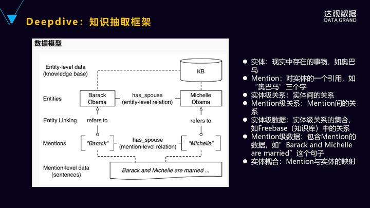
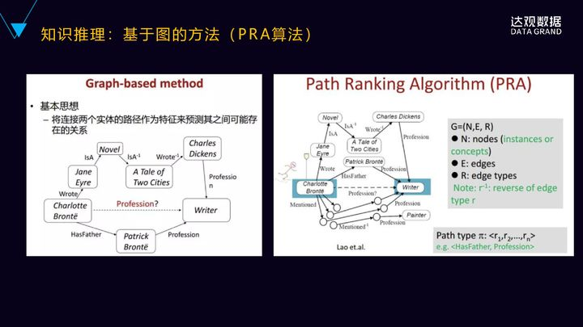
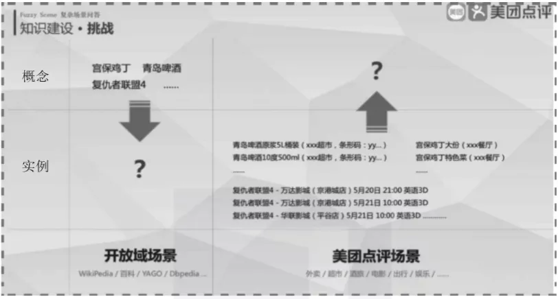

## 原理@历史

知识图谱本质上是一种语义网络，但是它最主要的特点是**一个非常大规模的语义网络**

### **Small knowledge + Big data=Big knowledge**

大数据知识这个词是BigKE，它将会显著提升机器认知智能水平，那么，大数据知识工程对我们人工智能最根本的意义是什么？是提升机器的认知智能水平。我们正在经历感知智能到认知智能的过渡阶段，未来最重要到技术即是实现认知智能。

大数据时代下，知识图谱又有什么独特的魅力？为什么会受到如此广泛的关注呢？
知识图谱使机器语言认知成为可能。机器想要认知语言、理解语言，**需要背景知识的支持**。而知识图谱富含大量的实体及概念间的关系，可以作为背景知识来支撑机器理解自然语言。

知识图谱使可解释人工智能成为可能。在人工智能发展的任何阶段，我们都需要**事物的可解释性**，现在的深度学习也常因为缺少可解释性受人诟病。而知识图谱中包含的概念、属性、关系是天然可拿来做解释的。 
 

**通过知识图谱等先验的知识去赋能机器学习，来降低机器学习对于样本的依赖，增强机器学习的能力。**

知识将显著增强机器学习能力。传统的机器学习都是通过大量的样本习得知识，在大数据红利渐渐消失的情况下，逐渐遇到发展瓶颈。而通过知识图谱等**先验的知识**去**赋能机器学习**，来降低机器学习对于样本的依赖，增强机器学习的能力，或许是连接主义和符号主义在新时代下的共生发展。

除了上述的种种优势，知识图谱在一系列实际应用上也非常有用，比如**搜索、精准推荐、风险识别、深化行业数据的理解与洞察**等，将在各种各样的应用场景发挥作用。

信息技术革命持续进行，数据将会继续向更大规模、更多连接的方向发展，在此背景下，知识图谱将引领知识工程走上复兴的道路，推动在机器身上实现认知智能。

从知识工程到知识图谱全面回顾 - 学院的文章 - 知乎 https://zhuanlan.zhihu.com/p/66902635

### 语义

### 不同的视角去审视

我们可以从不同的视角去审视知识图谱的概念。

- 在**Web**视角下，知识图谱如同简单文本之间的超链接一样，通过建立数据之间的语义链接，支持语义搜索。
- 在**自然语言处理**视角下，知识图谱就是从文本中抽取语义和结构化的数据。
- 在**知识表示**视角下，知识图谱是采用计算机符号表示和处理知识的方法。
- 在**人工智能**视角下，知识图谱是利用知识库来辅助理解人类语言的工具。
- 在**数据库**视角下，知识图谱是利用图的方式去存储知识的方法。

目前，学术界还没有给知识图谱一个统一的定义。在谷歌发布的文档中有明确的描述，知识图谱是一种用图模型来描述知识和建模世界万物之间关联关系的技术方法。

### 层次@智能

感知智能

认知智能

现在的机器学习，深度学习实用性的提高，主要得益于**当前大数据的获取相对容易**和**计算能力的提升**

> 人工智能的**研究领域**包括**认知建模、知识表示、推理及应用、机器感知、机器思维、机器学习、机器行为和智能系统等**，其研究目标即**提升智能体**的推**理，知识，规划，学习，交流，感知，移动和操作物体的能力等**，这也体现了这类系统通过感知获取信息和知识，通过推理得到新知识，提升其思维和学习能力并最终通过行为与外界交互的思想。
>
> 知识图谱历史简介及招聘 - 朱金华的文章 - 知乎 https://zhuanlan.zhihu.com/p/50239242

### **AI为什么需要知识图谱？**

**人工智能分为三个阶段**，从机器智能到感知智能，再到认知智能。

> **机器智能**更多强调这些机器的运算的能力，大规模的集群的处理能力，GPU的处理的能力。
>
> 在这个基础之上会有**感知智能**，感知智能就是语音识别、图像识别，从图片里面识别出一个猫，识别人脸，是感知智能。感知智能并非人类所特有，动物也会有这样的一些感知智能。
>
> 再往上一层的**认知智能**，是人类所特有的，是建立在思考的基础之上的，认知的建立是需要思考的能力，而思考是建立在知识的基础之上，必须有知识的基础、有一些常识，才能建立一些思考，形成一个推理机制。
>
> **AI需要从感知智能迈向认知智能，本质上知识是一个基础，然后基于知识的推理，刚好知识图谱其实是具备这样的一个属性。**

知识图谱其实是富含有实体、属性、概念、事件和关系等信息，它能够基于一定的推理。且比较关键的是，它能够基于一定的推理为AI的可解释性，带来全新的一个视角。

**可解释性已被一些领域AI大规模使用。**

深度学习的可解释性非常差的，深度学习里面内部的语义表达、向量的表达都是一些浮点数，人类是非常难以理解的。深度学习出来的结果，它的可解释性也是非常少的。

尽管我们现在在研究可视化的技术，把中间的它的结果呈现出来、可视化出来，但是真正能达到对人有效的解释性进展还是比较缓慢的。

知识图谱实际上是有望能够消除人类的自然语言跟深度学习黑盒之间的语义鸿沟。也就是**深度学习的底层的特征空间和上层的人的自然语言空间这种巨大的语义鸿沟，通过深度学习跟知识图谱结合起来，有望能够消除。**

##### 通用知识图谱和行业知识图谱**

我们再来看一下通**用知识图谱和行业知识图谱**，它们这两个之间的区别。

**通用知识图谱**实际上是谷歌或者百度这样的大型的互联网公司在构建的，它主最主要是用于它的搜索引擎，它面向的是通用领域，它的用户是全部的互联网的用户，它**构建是常识性的知识为主**，包括结构化的百科知识，它**强调的更多的是一种知识的广度，对知识的深度方面不做更多的要求**，它的使用者也是普通的用户。

对于**行业知识图谱**来讲的话，它的整个定位就不一样，它**首先是面向一个特定的领域**，它的**数据来源是来源于特定行业的语料**，它是**基于行业的数据来构建**，而且要**有一定的行业的深度**，它**强调的是更多的是深度，而不是广度**，能够解决行业人员的问题，它的使用者也是这个行业内的从业人员，或者是这个领域里面的专业人员来使用。

**通用知识图谱和行业知识图谱，个并不是说完全互相独立的，是具有<u>互相互补性</u>的关系。**

一方面，通用知识图谱会**不断的吸纳行业或者领域知识图谱的知识，来扩充它的知识面，然后增加它的知识的广度。**

同时我们在构建一个行业知识图谱或者领域知识图谱的时候，实际上也并不是说只局限在这个领域的基本的数据，我们同时还要去通用知识图谱里面去吸纳更多的常识性的知识来作为补充，只有这样才能构成一个非常完整的行业知识图谱。

上面第一部分就讲完了，大概讲了一下知识图谱的概念，包括AI为什么需要知识图谱，以及举了相关的例子。第二部分我想更着重的讲一下知识图谱**在行业里面的具体的应用。**

### 体系架构 

知识图谱的构建方式有自顶向下(top-down)、自底向上(bottom-up)，目前大多数采用bottom-up。

https://zhuanlan.zhihu.com/p/201213925

> 我们对接的数据源主要有公安的**静态数据源及动态数据源**，静态数据主要是一些存量数据，包括信息系统的结构化数据，也包括一些非结构化数据。动态数据则指采集的视频，抓拍图片，警情事件等。整个软件架构的数据流向即指明了数据->信息->知识->智慧的转化过程，为人所用，为解决具体问题所用。
>
> 知识图谱历史简介及招聘 - 朱金华的文章 - 知乎 https://zhuanlan.zhihu.com/p/50239242

**03 知识图谱的架构**

知识图谱的架构涉及知识表示、知识获取、知识处理和知识利用等多个方面。

一般情况下，**知识图谱构建流程如下：**首先确定知识表示模型，然后根据不同的数据来源选择不同的知识获取手段并导入相关的知识，接着利用知识推理、知识融合、知识挖掘等技术构建相应的知识图谱，最后根据不同应用场景设计知识图谱的表现方式，比如：语义搜索、智能推荐、智能问答等。

**从逻辑上，我们可以将知识图谱划分为两个层次：数据层和模式层。**数据层可以是以事实为单位存储的数据库，可以选用的图数据库有RDF4j、Virtuoso、Neo4j等三元组。

**<实体，关系，实体>**或者**<实体，属性，属性值>**可以作为基本的表达方式，存储在图数据库中。模式层建立在数据层之上，是知识图谱的核心。通常，通过本体库来管理数据层，本体库的概念相当于对象中“类”的概念。借助本体库，我们可以管理公理、规则和约束条件，规范实体、关系、属性这些具体对象间的关系。

知识图谱有**自顶向下**和**自底向上**两种构建方式。自顶向下构建是指借助百科类数据源，提取本体和模式信息，并加入知识库中。自底向上构建是指借助一定的技术手段，从公开的数据中提取资源，选择其中置信度较高的信息，经人工审核后，加入知识库中。

在知识图谱发展初期，多数企业和机构采用自顶向下的方式构建知识图谱，目前大多企业采用自底向上的方式构建知识图谱。

知识图谱的架构如图3-6所示。

▲图3-6 知识图谱的架构

- **知识源：**包括结构化数据、非结构化数据和半结构化数据。
- **信息抽取：**就是从各种类型的数据源中提取实体、属性以及实体间的相互关系，在此基础上形成本体的知识表述。知识图谱的构建过程中存在大量的非结构化或者是半结构化数据，这些数据在知识图谱的构建过程中需要通过自然语言处理的方法进行信息抽取。从这些数据中，我们可以提取出实体、关系和属性。
- **知识融合：**主要工作是把结构化的数据以及信息抽取提炼到的实体信息，甚至第三方知识库进行实体对齐和实体消歧。这一阶段的输出应该是从各个数据源融合的各种本体信息。
- **知识加工：**知识加工阶段如图3-6所示，其中知识推理中重要的工作就是知识图谱的补全。常用的知识图谱的补全方法包括：基于本体推理的补全方法、相关的推理机制实现以及基于图结构和关系路径特征的补全方法。

> ## 终于有人把知识图谱讲明白了                
>
> ​      刘宇 赵宏宇 等      [                         大数据DT                      ](javascript:void(0);)                                                              *2月21日*                

## **构建知识图谱**

### 抽取

##### 语义知识的形式化

知识图谱还是比较通用的语义知识的形式化描述框架，**它用节点表示语义符号，用边表示语义之间的关系**，如图3-1所示。在知识图谱中，人、事、物通常被称作实体或本体。

 

知识图谱的组成三要素包括：实体、关系和属性。

- **实体：**又叫作本体（Ontology），指客观存在并可相互区别的事物，可以是具体的人、事、物，也可以是抽象的概念或联系。实体是知识图谱中最基本的元素。
- **关系：**在知识图谱中，边表示知识图谱中的关系，用来表示不同实体间的某种联系。如图3-1所示，图灵和人工智能之间的关系，知识图谱和谷歌之间的关系，谷歌和深度学习之间的关系。
- **属性：**知识图谱中的实体和关系都可以有各自的属性，如图3-2所示。

 

知识图谱的构建涉及知识建模、关系抽取、图存储、关系推理、实体融合等多方面技术。知识图谱的应用则体现在语义搜索、智能问答、语言理解、决策分析等多个领域。

**三元组构成的，构成知识图谱的核心其实就是三元组，三元组是由<u>实体、属性和关系</u>组成的（由Entity、Attribute、Relation组成）。**

> **为什么要用三元组来描述知识图谱？**
>
> 三元组是一个人和计算机都易于理解的结构，人是可以解读的，计算机也可以通过三元组去处理，所以**它是一个既容易被人类解读，又容易被计算机来处理和加工的结构，而且它也足够的简单**，如果说你扩充成四元组、五元组，它整个结构就会变得比较复杂，那是综合的一种复杂性和人的易理解性、和计算机的易出理性来综合的考虑，决定用三元组的结构来去作为它的一个存储。
>
> 从不同来源、不同结构的数据中进行知识提取，形成知识(结构化数据)存入到知识图谱。

这个就是通过**关系**也好，通过**实体的属性**也好，通过**实体的概念**也好，可以去解释、去回答一些问题。

------

实体、属性以及关系抽取又被合称为**实体关系抽取（Entity and Relation  Extraction，ERE）**是信息抽取的关键任务之一。他将关系到知识图谱的最终效果，ERE是级联任务，**分为两个子任务：实体抽取和关系抽取**，如何更好处理这种类似的级联任务是NLP的一个热点研究方向。

> 既然是级联任务，就可以分为联合方法和Pipeline方法，他们又有什么意思？有什么优缺点呢？
>
> Pipeline：本人无中就是先抽取实体、再抽取关系。
>
> 联合方法：两个任务一起训练，集成损失。
>
> Pipeline方法易于实现，灵活性高，可以使用两份独立的数据集，但存在以下缺点：
>
> 误差积累：实体抽取的错误会影响下一步关系抽取的性能。
>
> 实体冗余：由于先对抽取的实体进行两两配对，然后再进行关系分类，没有关系的候选实体对所带来的冗余信息，会提升错误率、增加计算复杂度，比联合方法性能差。
>
> 交互缺失：将忽略实体与关系的内在联系和依赖关系。
>
> 后面分别说说实体抽取和关系抽取的具体方法。

----

##### 【抽象@建模】

知识抽取部分我放上了**概念及本体的发现**，也可称之为**本体建模**，

这个实际是对问题**域中概念的抽象**，即如何定义这个问题域所在的世界，存在哪些概念或类，哪些子类，哪些实体间的关系，每个实体及关系有哪些属性等，这实际即是**定义数据模型**，包括了类，属性，关系和词汇的集合。

这个严格来说不算知识抽取的步骤，但是却是知识抽取的基础。知识抽取具体一点包括了***实体抽取，关系抽取，属性抽取及规则抽取等***，这个对于静态数据是比较明确的，对于动态数据来说，人脸检测之后得到的目标可以认为是实体，经人脸融合之后进一步跟底库比对得到这是谁后也可以作为一个实体，抽取到哪一个层次要看解决的问题是什么。关系抽取比如监控视频中的同行人等。

【知识图谱历史简介及招聘 - 朱金华的文章 - 知乎 https://zhuanlan.zhihu.com/p/50239242】

数据采集

实体识别

关系抽取

事件抽取

##### 实体/属性抽取

**实体抽取**：也称为命名**实体识别（named entity recognition，NER）**，抽取文本中的原子信息元素，通常包含人物、时间/日期、组织/机构名、地理位置、任命、字符值等标签，具体的标签定义可根据任务不同而调整。

**常用方法**：序列标注的SoftMax和CRF（CNNs/RNNs/BERT+CRF）、Span抽取的指针网络、片段排列+分类、Seq2Seq（详情可参考[1]）；

> 这个里面首先抽取的实体，然后抽取的实体的属性，然后是实体之间的关系。我们看一下MER实体的抽取，我们知道MER可以转化为序列标注的问题，传统的机器学习的方法，CRF等都可以做，而且CFR做的效果还是不错的。CRF通常只能学习到3相邻词位置比较近的上下文的特征，它无法获取整个句子甚至更长的上下文的特征。目前业界比较主流的，包括学术界比较主流的一种做法是什么？是深度循环神经网络加上结合CrF，这样的做法更多的是双向的循环神经网络，它可以分别从前往后以及从后往前这两个方向来去学习上下文的特征，然后进行序列信号的记忆和传递，这个是一种比较常见的做法。
>

比如这个例子，华为发布了新一代的麒麟处理，通过从前往后就可以推理出后面的那个字，然后从后往前也可以推理出向朝鲜和美国进行签订了新一轮的战略谅解协议备忘录。第一个字“朝”实际上是从后往前去进行预测推理。顶层用CRF对循环神经网络的结果进行约束就可以，把结果控制的会更好，把这个得到更好的控制。然后输入层通常是词向量或者字向量，embedding能可以把单个字或者词转化为低维的稠密的语义向量。这样相对传统高维编码的好处，这里不再赘述。

##### 关系抽取

关系抽取(Relation Extraction)：关系抽取通常**转化为一个分类问题**，分类label是依据前面schema定义好的一些type、property的关系。

常用方法：模板匹配、监督学习、半监督学习（详情参考[1]、[2]）。

**下面讲一下关系抽取的技术**。它有几种方法，第一种是基于**有监督**的方法，就是把关系抽取**当做分类问题来看待**，就根据训练数据设计有效的特征，来学习各种分类模型，就是传统的分类。这个方法需要它的不好的地方，就是需要大量的人工标注的训练语料，但我们知道语料的标注是非常的耗时耗力的。所以在有监督的基础上，又提出了一种半监督的方式，半监督的方式主要采用方式进行关系的抽取，具体来说就是要对于要抽取的关系，首先基于手工设定若干的种子的实例，然后迭代性的从数据当中抽取关系对应的关系模板和更多的实例，通过不断迭代的方式来抽取越来越多的这些实例。

还有一种是**无监督**的方法，它本质上是一种**聚类**的方法，用拥有相同语义关系的实体，它拥有相似上下文的信息是它的假设，因此它可以利用每个实体的上下文的信息来代表实体的语义关系，**对实体进行语义关系的聚类**。

这三种方法当中，有监督的方法能够抽取出有效的特征，然后在准确率和召回率方面是更有优势的，**半监督和无监督的方法一般情况下它的效果都不是特别的好，所以业界现在用的比较多的还是有监督的学习的方法**。我们刚刚提到有监督学习方法，比较困难的地方就是怎么样获取大量分类的训练样本，完全通过人工去标注的方式显然不是比较好的方式。

这有什么样好的处理的方法？就是**远程监督**的一种方法，典型的工具叫**Deepdive**，也是斯坦福大学InfoLab实验室开源的知识抽取的系统，**通过弱监督学习的方法，从非结构化的文本当中可以抽取出结构化的关系的数据**。它比较好的地方就是开发者不需要理解它里面的具体的算法，只要在概念层次进行思考基本的特征就可以了，然后也可以使用已有的领域知识进行推理，然后也能够对用户的反馈进行处理，可以进行实时反馈的一种机制，这样能够提高整个预测的质量。背后用的是也是一种远程监督的技术，只要少量的运训练的数据就可以了。

接下来我们来具体来看一下它是怎么样来做这样一件事情的。首先，下面看到Mention的句子就是“奥巴马和米歇尔结婚”，它是句子，但Mention就是这些词的标记，奥巴马米歇尔都是Mention，然后我们要推测它之间是不是配偶的关系。这个时候要对Mention奥巴马和米歇尔这个Mention分别到知图谱里面去，然后去对应到知识图谱里面具体的实体，奥巴马和米歇尔就对应的实体，然后看一下这两个实体在知识图谱里面是不是存在着这样配偶的关系？如果是的话，我就把它拿过来作为正的训练样本，如果只图里面不是的话，它就是负的样本。我们的前提假设就是知识图谱里面的它的实体之间的关系都是正确的，以这个为依据去做样本的标注。

**目前进行实体关系抽取有两大类方法**，前面有一类是基于流水线式的抽取，就输入一个句子，首先抽取这实体，再对实体进行两两组合，然后再进行分类，最后识别出实体之间的关系。**这种做法是有缺点的**，第一，它容易造成错误的传播，比如在第一步的时候，实体如果识别错误了，后面的关系肯定也是错误的。第二，会产生没有必要冗余的信息，因为要对实体进行两两的配对，然后再进行关系的分类，很多配对之间实际上就没有这样的关系，就是它会带来了这样非常多的冗余的信息，错误率也会被放大、被提升。

现在用的比较多的另一种方法是联合学习的方法，就是输入一个句子，然后通过实体识别和关系抽取的联合模型，可以直接得到有效的三元组。通常我们是基于神经网络的联合标注的学习的方法，它这里面涉及到两个关键的工作，一个是模型的参数共享的问题，还有一个就是标注策略，怎么样进行有效的标注。模型共享是指的是在实体训练的时候能够进行实体识别和关系分类这两个任务，都会通过反向传播来匹配来进行关系的分类，所以仍然会产生没有关系的时候。然后同时来实现这两个参数之间的依赖，两个子任务之间的依赖。参数共享的方法，它本质上还是两个子任务，只是说它们这两个任务之间通过参数共享有了交互，而且在训练的时候还要预先进行MER，MER之后再根据MER的预测信息进行两两匹配，来进行关系的分类，所以仍然会产生没有关系时候冗余的信息存在。

现在我们新提出了一种端到端序列标注的策略，它是把原来涉及到序列标注和分类的两个任务变成了完全的端到端的序列标注的问题，然后通过端到端的神经网络模型，就可以直接得到关系的三元组，就是实体关系的三元组。新的标注策略是像下面这张图里面有三个部分来组成的，第一部分是实体中的词的位置，比如说b是表示开始，i表示是在实体的内部，e表示是实体的结尾，s表示是单个的实体。第二部分就是关系类型的信息，预定义的关系类型的编码，比如说里面的CP、CF，CP是国家总统，CF是公司创立者，这样两种的关系。然后还有实体的角色的信息，它表示是实体1还是实体2？实体跟关系之外的其它的这些字符都用O来表示，这样就进行了实体的标注。

### 融合@消歧

知识融合阶段需要对从多源异构数据源中抽取的各类动静态数据进行融合，融合时要对各种地址，描述不一的情形，对同一人多次抓拍的情形进行融合消岐合并处理。【知识图谱历史简介及招聘 - 朱金华的文章 - 知乎 https://zhuanlan.zhihu.com/p/50239242】

接下来我们讲一下实体的融合，这里最主要就是实体的对齐。首先是实体对齐，也叫实体规划，是把具有不同的标识的实体，但是在现实世界当中可能是表达同样意思的，把它做规划。比如说中华人民共和国、中国和China，这个三个指的是同实体，尽管它的表述方式不一样，就把它规定为具有全局唯一标识的实例对象，然后添加到知识图谱当中去。

现在实体对齐普遍采用的还是一种聚类的方法，关键在于定义合适的相似度的阈值，一般从三个维度来依次来考察的，首先会从字符的相似度的维度，基于的假设是具有相同描述的实体更有可能代表同实体。第二个维度，是从属性的相似度的维度来看的，就是具有相同属性的和以及属性词的这些实体，有可能会代表是相同的对象。第三个维度，是从结构相似度的维度来看，基于的假设是具有相同邻居的实体更有可能指向同对象。

进行融合的时候要考虑各个数据源的数据的可靠性，以及在各个不同数据源当中出现的频度来综合决定选用哪个类别或者哪个属性词。还有一种方法就是是用来自LD，LD是很多人工标记好的数据，是非常准确的，里面有叫sans，它表示前后两个是同实体的，利用这个作为训练数据来发现更多相同的实体对，是比较好的方法。最后要说的是，无论用哪种方法，都不能保证百分之百的准确率，所以最后也要有人工审核和过滤。

融合消歧主要解决两个方面：1）多个不同实体词或代称指向同一个意义；2）同一个实体词指向不同的意义，因此主要分为实体统一，指代消解，实体消歧。这里也是导入第三方数据的最佳地方。

下面分别说说解决方案：

##### 实体统一

实体统一（Entity Resolution）：同一个实体有不同的表达方式，有时候需要把不同的表达方式统一为同一种表达方式。

例子：“中华人民共和国”，“中国”**都表示同一个意思**。

方法：相似度方法、关键词**模板标准化**，

##### 指代消解

指代消解（Coreference Resolution）：各段落或文章，将实体词与指代词做分类任务（一般用二分类），对**你, 她, 他, 她们, 你们, 她们, 他们等指代词进行定位**。

##### 实体消歧

实体消歧(Entry Disambiguation)：本质在于一个词有很多可能的意思，也就是在不同的上下文中所表达的含义不太一样。

例子：“今天苹果公司发布了新产品”和“这个苹果里面长了虫”这两个句子中的“苹果”代表的含义是不一样的。

方法：将实体词库内的词向量，加入不同的句子中得到句向量v1，v2，再计算去掉实体词的句向量vr，计算sim(vr,v1)和sim(vr,v2)，对比两个结果，相似度高的为实体词真实指代的实体。

##### 迭代

迭代目的有两个，新算法上线效果对比，线上算法运行效果监控，保持或优化在最新数据上的泛华能力，也可以叫做评估与优化。

这里推荐评估建议，历史测试集评估+新数据预测结果评估，需时刻关注评估结果波动，如出现大波动需要预警与跟进。

Ps：本次新数据预测结果标注后，可以在下一次评估时加入历史测试集，这样下一次评估可以和本次全量结果对比，也不影响看新数据的波动趋势，如预测成本较高，可以只保留部分批次评估集。

#### 4、知识补全

对于知识补全，其主要思路其实也可以利用表示学习的方法，把头尾实体以及关系表示成低维、稠密的向量，然后再通过相关的评分函数进行排名。具体可以参考《[基于知识图谱推理的关系推演](https://zhuanlan.zhihu.com/p/42340077)》

详细的知识图谱构建流程 - 徐超的文章 - 知乎 https://zhuanlan.zhihu.com/p/44123660

### 存储/查询

知识存储则涉及知识的落盘，这个如RDF/OWL的Turtle、JSON序列化，如属性图的图数据库存储，结构化数据，非结构化数据的融合存储等 【知识图谱历史简介及招聘 - 朱金华的文章 - 知乎 https://zhuanlan.zhihu.com/p/50239242】

知识图谱主要有两种存储方式：一种是基于RDF的存储；另一种是基于图数据库的存储。它们之间的区别如下图所示。RDF一个重要的设计原则是数据的**易发布以及共享**，图数据库则把重点放在了**高效的图查询和搜索上**。

其次，RDF以三元组的方式来存储数据而且不包含属性信息，但图数据库一般以属性图为基本的表示形式，所以实体和关系可以包含属性，这就意味着更容易表达现实的业务场景。

缺点是图数据库的更新比较复杂，对于复杂查询的支持不够。所以我们使用以图数据库为主，结合其他系统的方式来存储知识图谱。

我们再看一下知识存储，就是如何选择数据库，从选择层面，我们有图数据库，有NoSQL的数据库，也有关系的，数据库有很多选择。具体什么样的情况下选择什么样的数据库？通常是如果说知识图谱的关系结构非常的复杂、关系非常的多，这时候建议使用这个图数据库，比如Neo4J这样的数据库。另外一种就是它的关系并不是很复杂，关系可能也就是1度、2度之多到3度的关系，更多的它是有非常多的属性的数据，这个时候可以考虑关系式数据库，或者是ES这样的存储。如果要考虑到知识图谱的性能、可扩展性、可分布式，是可以结合NoSQL的数据库，比如说Hbase等等。根据实际的情况，一般是综合起来使用的，就是根据我们的经验，我们会结合Neo4J和ES来综合来使用，同时还结合这关系型数据库MySQL等等，根据不同的数据的特点来进行选型，而不是说一味的追求图数据库。

#### 图数据库

我们来看一下目前主流的几款图数据库，Titan、Graph、Neo4J这个三个分别都是开源的，然后Titan是阿帕奇下面的，Graph是MIT，Neo4J是开源的一种商业的，既有商业版，也有也有开源免费版。然后它们的平台，像Titan是Linux，Graph是windows。而数据的支撑量级，像Titan是后端存储，基于callcenter，Hbase的分布式存储引擎，可以支持更大的数据量，千亿级的数据量级；Neo4J商业版也可以支持到百亿级的，但是它的非商业版在数据量级比较大的时候，就是一般是在几千万级的时候就可能会出现一些问题。

#### 体系应用

如需检索使用，可将数据同步至ES，便于模糊查询。

如需实时更新，可先将更新操作先存储至mysql，再进行同步。

如有大批量数据，可先存储至hadoop，再离线同步至图数据库。

总的来说，知识图谱的存储方式并不固定，需根据数据和需求的情况进行改变，可以结合各种数据库的优势。

基于 Kafka 技术栈构建和部署实时搜索引擎的实践、

https://www.infoq.cn/article/mHvoN3C4tkwNcZJ7KkYB

**[语言 & 开发](https://www.infoq.cn/topic/development)[开源](https://www.infoq.cn/topic/opensource)[大数据](https://www.infoq.cn/topic/bigdata)[Kafka](https://www.infoq.cn/topic/kafka)[最佳实践](https://www.infoq.cn/topic/best-practices)

### 实体链接

### 知识计算

知识计算此处我从知识推理中单独列出主要是强调一些深度关系挖掘等依赖图计算引擎如GraphX,Giraph才能实现的复杂计算处理。【知识图谱历史简介及招聘 - 朱金华的文章 - 知乎 https://zhuanlan.zhihu.com/p/50239242】

#### GraphX,Giraph

### 知识表示

知识表示方面，图中我给出的是具体的实现技术了，实际在理论上是分为符号表示及向量表示，后者向量是把信息的向量化表示，涉及到一定规则的编码等，其似乎是一个新的理论研究方向，但我对其没研究不做展开。符号表示的就常规的了，可以有基于本体论理论基础的RDF/OWL系列，有基于属性图的，也有继续采用结构化数据会非结构化数据的表示方式，这个不能排除。RDF/OWL系列理论中认为知识是主谓宾三元组的陈述，OWL进一步扩充了Schema及逻辑推理能力，这类知识表示并没有关系属性和实体属性的概念及存在。属性图的知识表示中则有了这部分能力，所以在属性图中很简单的图结构在RDF中则需要很复杂的结构。

知识图谱历史简介及招聘 - 朱金华的文章 - 知乎 https://zhuanlan.zhihu.com/p/50239242

### 知识推理/挖掘

知识推理主要包括对前面获取的知识按照规则，逻辑描述等进行补全，也可以进行一些异常关系的检验等基本推理。此步一般可挖掘出一些简单的隐含知识。

【知识图谱历史简介及招聘 - 朱金华的文章 - 知乎 https://zhuanlan.zhihu.com/p/50239242】

我们再看一下知识推理，知识推理这边有几种方法，首先是基于符号推理，我们上面说的三元组的结构，比如说左边的RDF，有概念，就是实例的结合，然后基于概念进行推理。我在最开始讲的 Google 的例子就是基于符号三元组形成的简单推理。

#### 基于OWL进行本体推理

这个是基于OWL进行本体推理的例子，OWL有特有的语法，我们来看一下右边的例子，苹果由富达和黑石投资，可以表示成苹果，然后它有这样的左项的符号，它存在一个BeinvestedBy，就是富达且苹果，这样的一个表达式。然后借助富达投资公司都是创新企业，然后借助黑石投资的公司都是创新企业，有一个投资即是帮助融资这样的基本事实，就可以推导出苹果由富达投资，苹果由黑石投资，苹果是一家创新企业。

#### **基于图（PRA）的推理**

还有一种是基于图（PRA）的推理的方法，更直观的一种方法，思想是比较简单的，就是连接两个实体的路径作为特征，来预测它们之间可能存在的关系。比如说左边这个图里面Charlotte Bronte，我们要预测他的职业是不是作家，是作家，在这个图里面已知存在关系是什么呢？他写过一篇小说，它写过一篇小说Jane  Eyre，然后双城记也是一部小说，狄更斯是写了双城记这部小说，狄更斯是作家，同时它下面还有他的父亲职业也是作家，所以基于这样图之间的关系，就可以较大概率的推理出Charlotte Bronte的职业很有可能就是作家，这就是基于图之间的关系的特征来进行预测的。

#### Trans系列的模型

还有是基于分布式的知识语义表示的方法，比如说像Trans系列的模型，然后再这个模型基础上进行语义的推理。首先是看一下TransE，Trans就是翻译的意思，其实这跟翻译关系并不是特别的大，但这里面叫Trans。Trans这个模型的思想也比较直观，它是讲每个词表示成向量，然后向量之间保持一种类比的关系。比如说上面这个图里面的北京中国，然后类比巴黎法国，就是北京加上首都的关系就等于中国，然后巴黎加上capital的关系等于France。所以它是无限的接近于伪实体的embed]ding。这个模型的特点是比较简单的，但是它只能处理实体之间一对一的关系，它不能处理多对一与多对多的关系。

后来提出了TransR的模型了，TransR实际上是解决了上面提到的一对多或者多对一、多对多的问题，它分别将实体和关系投射到不同的空间里面。一个实体的空间和一个关系的空间，然后在实体空间和关系空间来构建实体和关系的嵌入，就对于每个元组HRT首先将实体空间中实体通过Mr向关系空间进行投影得到hr和Tr，然后Hr加上r是不是约等于或者近似的等于Tr，通过它们在关系空间里面的距离，来判断在实体空间里面，H和T之间是不是具有这样的关系？

除了TransE、TransR，还有更多的Trans系列的，像TransH、TransN、TransG等等这些模型。清华大学的自然语言处理实验室发布了一款这个叫openKE的平台，openKE它是开源的知识表示学习的平台，就基于Tanserflow的工具包来开发的。它整合了Trans系列的很多算法，提供统一的接口。然后它也是面向了预训练的数据来表示模型的。大家有兴趣可以去看一下openKE，一个表示知识学习的平台。

#### 基于深度学习的推理

还有一种是基于深度学习的推理，这里的一个例子是利用了卷积神经网络对实体进行关系的分类的，它不一样的地方是什么？是它把依存树作为输入，就是将词在树中的不同的位置的嵌入式的表示拼接到这个词向量当中来学习，同时对面相树结构设计了独特的卷积盒。这种方法在实体分类的任务上，相较于未使用位置关系的信息，效果会有一定的提升，这也是其中一种方法。

前面讲完了知识图谱构建的关键的技术和相关的算法，第四部分我想结合我个人的体验经验，还有公司的案例，来分享一下构建知识图谱要注意的或者是要关注的地方。

## Others

### 应用行业@领域

当这个问题的答案来自知识库时，这一类的问题，我们通常称它为叫KBQA，叫“面向知识库的自然语言问答”。

KBQAI的核心步骤就是**建立从自然语言的问答到知识图谱、知识库的三元组的位置映射的关系。**

充分的利用知识图谱的概念和对实体的表示、概念的表示，然后再利用概念的属性，就可以比较好的能回答这一类的自然语言的语义问题。

**知识图谱实际上在多个行业里面已经有所应用**了，只是说我们可能没有直观的去看到，比如说我们在日常使用的通用搜索引擎，谷歌、百度等等，它背后都是有知识图谱的在支撑的。

包括聊天机器人，像微软小冰、公子小白，还有IBM的watson，它们的背后是知识图谱，包括私人助理，像siri、GoogleNow等等，还有applewatch，甚至智能家要想和人之间达到一种语音方面的交互，背后必然要理解自然语义，背后都是有知识图谱在做支撑的。知识图谱提供了背景知识，可以很好的来去解答人的相关的问题。

我们再来看一下，对于企业而言是什么样的状况？

首先我们来看一下企业面临的数据问题或者挑战吗？特别是大型的企业，它的应用系统有非常多的数据，这些数据大部分有很多都是非结构化的数据，以word、excelpdf等等格式存在，还一些有邮件，这些数据跟关系数据库相比占非常大的一部分，这些数据是非常难以理解的，但是这些数据里面又蕴藏着非常多的有价值的东西在里面。

还有一个问题，大型的公司有非常多的系统，然后这些系统的数据之间是互相很多情况下是互相独立的，是难以融合的数据孤岛。数据模式的动态变化也比较困难，数据使用的专业程度比较高（企业里面的专业领域的数据，产品的数据，技术的文档），所以说很难做行业的智能问答。

但是，在企业的业务方面又存在着非常多的相关的需求，比如说业务方面又要求对这些无结构化的文档进行语义理解，要求对这些散落在企业各地的信息孤岛、数据孤岛进行关联的探索，数据的关联的探索，然后要求对业务支持动态的扩展，模式的动态的扩展，又要求能够支持自动的智能的搜索和问答。

一方面是我们在数据上面面临的诸多的这些挑战，另一方面，在业务方面又有强烈的相关的需求，什么样的技术方案能够很好的来把这两者对接起来？

目前来看知识图谱是解决这一类问题，满足用户相关需求比较好的方案。

我们来再进来进一步看一下知识图谱在其它行业的应用。

###### **（一）金融行业的应用**

在金融行业里面比较典型的就是**风控反欺诈**。

**1.不一致性的检查**

知识图谱可以进行信息的不一致性检查，来确定是不是存在可能的借款人欺诈的风险，比如说第一个图里面的借款人甲和乙来自于不同的公司，但是他却非常诡异地留下了相同的公司的电话号码，这个时候是审核人员就要格外留意了，这里面有可能会存在欺诈的风险。

**2.组团欺诈**

甲乙丙三个借款人同一天向银行发起借款，他们是互不相关的人，但是他们留了相同的地址，那这个时候是有可能是组团的欺诈。存在这样的可能。

**3.静态的异常检测**

它表示的是在某个时间点突然发现图中的某几个节点的联系异常的紧密，原来可能大家是互相联系都比较少、比较松散的，突然间有几个点之间密集的联系，也是有可能会出现是欺诈组织。

**4.动态的异常检测**

我们来看第二行中间图，随着时间的变化，几个节点之间图的结构发生明显的变化，原来可能是比较稳定的，左边黑色的上三角、下三角，然后中间连线，但过了一段时间之后，它整个图的结构变成了右边的这样结构，此时很可能是异常的关系的变化，也有可能是一个欺诈阻止。

**5.客户关系管理**

怎么样去做失联客户的管理？比如图中的理事是一个借款的用户，但是银行可能现在没有办法直接找到他，甚至通过他的直接联系人也没办法找到他，那这个时候是不是可以再进一步的通过他的二度联系人来间接的来找到他。

通过这样的图结构是可以快速找到他的二度联系人，比如张小三或者是王二，去联系他们，尝试把李四这个人给找到。

###### **（二）辅助信贷审核和投研分析**

左边这个实际上是辅助审贷，知识图谱它会融合多个数据源，从多个维度来维护关联人员的信息，来避免数据不全与数据孤岛，它把它整合到一个大的网络结构里面去，借助知识图谱的搜索，审核人员可以快速的获取到信贷申请人张三的相关的信息，比如住址、配偶、就职公司、他的朋友等等。

这个比原来的传统的方法要到各个不同的散落的数据源去搜集的效率要快得多，而且能够从整体上来看到它的相互之间的关联关系。

第二个图是用于辅助投研的，知识图谱它实时能够实时地串联起来这个公司相关的公司，比如说供应商的关系、竞争者的关系、客户的关系、投融资那些关系等等，然后可以快速实时的定位。

中信通讯这家公司前不久被美国政府进行合规性审查，这个时候投研人员通过知识图谱搜索之中兴通讯这公司的时候，就可以非常快地得到跟中兴通讯相关的上下游这些公司，跟它有关联的子公司、供应商、客户、竞争对手、合作伙伴等等，这样就又可以有助于投研人员快速的来做决策。

###### **三. 精准营销应用**

这个里面精准营销，就知识图谱，能够知道你的客户的非常详细的信息，包括名字，住址，经常和什么样的人进行互动，还认识其它什么样的人，网上的行为习惯、行为方式是什么样子。

这样就可以知识图谱挖掘出更多的用户的属性标签和兴趣标签，以及社会的属性标签，基于知识图谱就可以进行个性化的商品核心活动的推送能够实现，从而实现精准的营销。

###### **四. 知识图谱在搜索引擎里面的应用**

最典型的就是在谷歌搜索引擎里面应用。谷歌是在2012年率先提出来知识图谱的概念，提出这个概念的最主要的目的就是用于改善它的搜索引擎的体验。

我们从这个图就可以看到，用户搜索的是泰姬陵，泰姬陵是印度的非常著名的，也是世界八大奇迹之一的景点。

这里面不一样的地方是它在搜索引擎的右侧，会以知识卡片的形式来呈现跟泰姬陵相关的结构化的信息，包括泰姬陵的地图、图片、景点的描述、开放时间门票等等，甚至在下面会列出跟泰姬陵相类似或者相关联的景点，比如中国的万里长城同样是世界的几大奇迹，包括金字塔等等，这样的知识点，可以非常好的把知识组织和关联起来。

同时，它还可以进行知识的扩展，比如说泰姬陵不光是印度的景点，它还可以是这个一个音乐专辑，它甚至是国外某城市的街区街道，也叫泰姬陵。

这样通过知识图谱可以不断的去探索发现新的非常新奇的东西，让用户在搜索引擎里面能够不断的去进行知识的关联的发现，激发起用户的搜索的欲望。

原来我们搜索引擎讲究的是说快速的找到它的结果，然后关掉就完了，谷歌通过知识图谱，实际上是把搜索引擎变成了知识的探索和发现引擎，这是概念和理念上的非常大的变迁与升级。

###### **五.知识图谱应用于推荐系统**

我们熟悉比较熟悉的是**个性化推荐**，就是所谓的千人千面，比如根据游戏来推荐游戏的道具。

对于小白用户和骨灰级的用户，它推荐的东西显然是不一样的，这是个性化的推荐。

**个性化推荐之外，还有场景化的推荐**，比如用户购买了沙滩鞋，或者留意的沙滩鞋，用户他要去旅游海边度假这样场景，有呈现这样的场景，基于这样的场景可以继续给他推荐这游泳衣、防晒霜或者其它的海岛旅游度假的产品。

**还有一种是基于任务型的推荐**，比如用户买了牛肉卷或者羊肉卷，这个时候他实际上是要为了完成一项任务，这项任务就是吃一顿火锅，对吧？这个时候我可以给他推荐火锅底料或者是电磁炉等等。

还有一个场景，**推荐系统冷启动**一直是比较难以处理的问题，通常的做法就是根据新用户的设备类型，或者是他当前的时间位置等等，或者外面的关联数据来做推荐。

对于新的物品的话，我们在知识图谱这边的话，我们可能会通过语义的标签，比如说旅游和摄影实际上是语义相近的两个标签，还有一种比如相同的导演或者相同演员的电影在语义上也是比较相近的，那这个时候也可以做这样的推荐。

还有一种在推荐方面比较难的就是**跨领域的推荐。**

我们我们会看到在微博上面会去推荐淘宝的商品，在新浪微博的信息流里面，它是怎么做的？

新浪微博有些用户会经常去晒黄山、九寨沟、泰山等这些照片，这个时候我们就知道他有可能是一位登山达人，或者是登山的爱好者，这个时候淘宝就会可以给他推荐登山的装备，登山杖、登山鞋等等这些装备，就是知识图谱利用了这些背景知识，能够为不同的平台之间的语义鸿沟来打通。

还有一种是**知识型的推荐**，是基于知识的。

比如清华大学、北京大学都是985的顶级名校，复旦大学也同样是的，这个时候是可以推荐复旦大学，包括百度、阿里和腾讯，百度、阿里就可以推荐出腾讯，它是属于BAT的互联网的公司。

所以之前很多是基于用户的行为，然后去挖掘出基于行为的推荐，现在有了知识图谱以后，我们可以从基于行为的推荐，发展到行为跟语义相融合的智能推荐，就是结合更多的语义方面的互联互通信息，再加上用户的行为信息，来综合的做智能推荐。

##### **智能搜索**

如同我们在开篇介绍的例子，用户的查询输入后，搜索引擎不仅仅去寻找关键词，而是首先进行语义的理解。比如，对查询分词之后，对查询的描述进行归一化，从而能够与知识库进行匹配。查询的返回结果，是搜索引擎在知识库中检索相应的实体之后，给出的完整知识体系。

##### **深度问答**

问答系统是信息检索系统的一种高级形式，能够以准确简洁的自然语言为用户提供问题的解答。多数问答系统更倾向于将给定的问题分解为多个小的问题，然后逐一去知识库中抽取匹配的答案，并自动检测其在时间与空间上的吻合度等，最后将答案进行合并，以直观的方式展现给用户。

苹果的智能语音助手 Siri 能够为用户提供回答、介绍等服务，就是引入了知识图谱的结果。知识图谱使得机器与人的交互，看起来更智能。

##### **社交网络**

Facebook 于 2013 年推出了 Graph Search 产品，其核心技术就是通过知识图谱将人、
地点、事情等联系在一起，并以直观的方式支持精确的自然语言查询，例如输入查询式：“我朋友喜欢的餐厅”“住在纽约并且喜欢篮球和中国电影的朋友”等，知识图谱会帮助用户在庞大的社交网络中
找到与自己最具相关性的人、照片、地点和兴趣等。Graph Search 提供的上述服务贴近个人的生活，满足了用户发现知识以及寻找最具相关性的人的需求。

##### **垂直行业应用**

从领域上来说，知识图谱通常分为通用知识图谱和特定领域知识图谱。

在金融、医疗、电商等很多垂直领域，知识图谱正在带来更好的领域知识、更低金融风险、更完美的购物体验。更多的，如教育科研行业、图书馆、证券业、生物医疗以及需要进行大数据分析的一些行业。这些行业对整合性和关联性的资源需求迫切，知识图谱可以为其提供更加精确规范的行业数据以及丰富的表达，帮助用户更加便捷地获取行业知识。

#### **02 知识图谱的价值**

知识图谱最早应用于搜索引擎，一方面通过推理实现概念检索，另一方面以图形化方式向用户展示经过分类整理的结构化知识，从而使人们从人工过滤网页寻找答案的模式中解脱出来，可应用到智能问答、自然语言理解、推荐等方面。

知识图谱的发展得益于Web技术的发展，受KR、NLP、Web以及AI等方面的影响。**知识图谱的价值归根结底是为了让AI变得更智慧。**

##### **1. 助力搜索**

搜索的目的是在万物互联的网络中，能够使人们方便、快速地找到某一事物。目前，我们的搜索习惯和搜索行为仍然是以关键词为搜索目的，知识图谱的出现可以彻底改变这种搜索行为模式。

在知识图谱还没有应用到搜索引擎上时，搜索的流程是：从海量的URL中找出与查询匹配度最高的URL，按照查询结果把排序分值最高的一些结果返回给用户。在整个过程中，搜索引擎可能并不需要知道用户输入的是什么，因为系统不具备推理能力，在精准搜索方面也略显不足。

**而基于知识图谱的搜索，除了能够直接回答用户的问题外，还具有一定的语义推理能力，大大提高了搜索的精确度。**图3-3所示是知识图谱助力搜索示意图。

▲图3-3 知识图谱助力搜索

##### **2. 助力推荐**

推荐技术和搜索技术非常相似，但是稍有区别。搜索技术采用信息拉取的方式，而推荐技术采用信息推送的方式，所以在推荐技术中有一些问题，比如冷启动和数据稀疏问题。

以电商推荐为例介绍知识图谱在推荐上的应用。假设我买了手机，手机的强下位关系是手机壳，这样系统就可以给我推荐手机壳，同时也可以推荐相似或互补的实体。图3-4为知识图谱助力推荐示意图。

▲图3-4 知识图谱助力推荐

##### **3. 助力问答**

问答与对话系统一直是NLP在人工智能实现领域的关键标志之一。**知识图谱相当于是给问答与对话系统挂载了一个背景知识库。**

对于问答与对话系统或者聊天机器人来说，其除了需要实体知识图谱和兴趣知识图谱等开放领域的稀疏大图外，还需要针对机器人和用户个性化的稠密小图。同时，知识图谱是需要动态更新的。图3-5是知识图谱助力问答示意图。

▲图3-5 知识图谱助力问答

### 知识库@数据源

知识库：Freebase、Wikidata、 DBpedia、YAGO。

## **经验或者心得体会**

**第一，界定好范围。**

要有一个明确的场景和问题的定义，不能说为了知识图谱而知识图谱。没有想清楚知识图谱有什么样的应用的场景，或者能解决什么样的问题的时候是比较难以落地的。一定要有非常明确的场景，比如说解决商品数据的搜索问题，或者产品说明书里面问题回答的问题，这样明确的场景。

**第二，知识的定义。**

上面讲到的对于schema或者本体的定义。根据界定好范围，确定好场景和问题以后，就基于这样的场景或者问题，再进行相关领域的schema的定义。定义这个领域里概念的层次结构、概念之间的关系的类型，这样做是确保整个知识图谱是比较严谨的，知识的准确性是比较可靠的。知识的模型的定义，或者schema的定义，大部分情况下是通过这个领域的知识专家的参与，自上而下的方式去定义的。

**第三，数据是构建知识图谱非常基础的东西。**

数据的梳理就比较重要，就是需要什么样的数据？这就同样依赖于我们的问题是什么，我们的场景是什么？只有基于问题和场景，才能够梳理出领域相关的问题、相关的数据，包括结构化的数据、半结构化数据、无结构化的数据，还有结合百科跟这个领域相关的数据，还有领域里面的词典，或者这个领域的专家的经验的规则。

**第四，不要重复去造轮子。**

很多百科的数据和开放知识图谱的数据，是可以融合到我的领域行业知识图谱中，不需要从无到有的做这样事情。

**第五，必须要有验证和反馈机制。**

必须要有管理后台，用户可以不断的跟你的知识图谱系统进行交互，然后不断的进行反复确认和验证，这样就可以保证整个知识图谱每一步都是比较精确的。因为知识图谱的精确性，特别是在领域知识图谱，它要解决领域里面特定行业里面专业性的问题。如果说知识图谱本身的关系不是很精确，知识不是很精确，再进行一系列的推理，就有可能越来越不准确，最后得出的结论就有可能有比较大的偏差。

**第六，知识图谱构架的过程是持续迭代的系统的工程，不是一蹴而就的。**

要不断的进行人机的交互、持续的运营，不断的去丰富来完善数据、完善schema等等，最后一步一步的像滚雪球一样把它滚起来。

最后给大家介绍**中文开放知识图谱**，达观数据也是中文开放知识图谱发起单位之一，这里面有很多开放的数据，包括很好的工具，包括文章也是非常好的学习材料与来源，大家可以关注，可以直接下载，也有可以通过API进行调用。

这个是现**有的公开的知识图谱的数据，**包括英文的像freebase、DBpedi、Yago等等，包括中文里面我们有复旦的知识工厂里面的开放式图谱，还有WikiData的，还有 [http://zhishi.me](https://link.zhihu.com/?target=http%3A//zhishi.me)等等，都是在openKG里面可以找到的。

这个就是我今天分享的全部的内容，大家有什么问题可以来提问。

**Q：用知识图谱来做反欺诈，和深度学习的方法相比，或者是其它机器学习的相比，知识图谱是否有优势？**

**A：**这个我上面也讲了，知识图谱实际上是提供了一种可解释性，因为知识图谱它基于三元组的结构，是人也易于理解的结构，它实际上是提供了一种可解释性，它解决了最后的一公里的问题。

我们知道，深度学习的方法，分布式向量表示的方法是内部是浮点数，然后内部的特征类型是怎么样去提取这些特征的，我们是很难知道它内部的运营机机制，它对我们来讲更多情况下可能是一个黑盒。

在金融这样比较关键的领域，比如说给你推荐投资组合，但如果说没有能给出一个比较好的解释或者建议，这样的结果是没办法到最后进行大规模的使用。更多的时候可能还是进行一些尝试。

结合知识图谱，就有望能够提供推荐方案的解释性，比如说给你提供推荐的理由，基于知识图谱的推理的规则，它最后给你推出这样的理财产品的组合，是基于什么理由等等。

**Q：知识图谱的查询跟关系数据库的查询感觉都一样，这两个有什么样的关系？**

**A：**要看知识图谱是查什么东西，比如你要查询非常复杂的关系，知识图谱基于图数据库方式，它的效率是非常的高的。我们知道在关系型数据库里面，如果要多个表来去查的话，特别在数据量比较大的情况下是非常慢的，这个两者相比之下，它的性能差距超过我们的想象，可能达到几百在上万倍的差距，差距非常大。

所以在关系非常复杂的情况下，图数据库是非常好的选择。它基于图的便利，内置对图搜索的优化算法，可以非常快速进行图的遍历，进行图的搜索。相较于传统的关系数据库，它的性能会有非常大的提升。

**Q：纯文本怎么进行取？**

**A：**纯文本就是我们说的无结构化的数据，我们知道数据来源既有结构化的关系数据库的数据，也有半结构化，可能是excel的表格，这些表格实际上是有结构的，更多的我们是纯文本的数据，比如说我们企业里面的word、pdf等等，这些数据都是被转换成纯文本以后，然后我们基于这些成文本进行知识的抽取。知识抽取里面就是要抽取实体和实体之间的属性，包括实体之间关系。

这个是怎么抽取？我上面的PPT里面也讲到了有很多的方法，包括实体抽取里面有MER的方法，MER有传统的CRM的方法，也有基于+CRF的方法，也有端到端的联合标注的方法。基于深度学习的深度循环神经网络端到端的进行，同时抽取出实体和实体之间关系的三元组的输出的方法。

**Q：知识图谱怎么和其它算法相结合，应用在搜索推荐上面？**

**A：**在搜索里面，更多的是基于图谱去回答问题，因为它可以进行分析，就是它可以对query里面的实体进行识别，然后对query里面的属性进行识别，比如说查询“华为P10手机的内存是多少?”这个就是实体属性的查找，华为P10是实体，内存是它的属性，然后对应到知识图谱里面，我很快的定位到这个实体叫P10，然后就可以直接把P10的内存属性读出来，它的属性值，比如说是64G、32G等等，就可以直接给出这样答案。

**Q：实体有哪些属性是怎么定义的？**

**A：**这个作为一个领域的话，我们进行模式定义的时候，会对这个概念进行定义，然后概念它会有属性。做实体的时候，映射到一个概念上面去，继承它这个概念的属性。面向对象既有继承，也有特有的属性，例如P10可能在概念手机这个概念上某些属性没有覆盖到新出现的P20上，P20可能有新的属性，这个时候要做属性的融合，最后会重新更新schema里的概念属性。

**Q：知识图谱中的时间和空间关系怎么表达？**

**A：**我们知道知识图谱是动态的数据，比如说美国总统是是特朗普对吧？现在是的，但不代表10年以后还是。随着时间的推移，它的三元组的关系会有变化的，那这个时候怎么样去表达？通常是在三元组的基础上再扩展一维就是四元组，可以这样的做法，但是它会增加表达或者处理的复杂度。通常你可以结合其他的方法，比如是不是可以跟关系数据库相结合的方式来。我在这里只是提供一个简单的思路。

**Q：如何衡量一个知识图谱建立以后的效果？如何有效的进行学习改进？**

**A：**这个是挺关键的，我们建立一个知识图谱，建立一个机器学习的算法模型，对它的效果进行衡量度量是非常重要的。在知识图谱这里，一定是基于某个场景具体的应用，然后再看这个场景或者这个具体的应用使用了知识图谱以后跟原来常规的方法来做一个比较，或者人有一个管理后台，然后人定期对知识图谱关系推理的结果做一些检测或者验证，然后对这些验证的结果再反馈到这个系统里面去，让系统重新来进行学习、改进。建立人跟系统之间不断的反馈和验证的过程。

**Q：可不可以用知识图谱进行分类？**

**A：**这个问题很有意思。上面提到，我们基于分类的方式来做知识图谱关系的学习。知识图谱可不可以进行文本的分类？是有助于进行文本分类的。我们知道，文本分类里，特别是一些短文本，通过知识图谱进行语义的关联扩充，是可以获得更多文本的特征，尤其是对于短文本，这样对分类效果有比较好的改进。

今天我的演讲到此结束，由于时间关系，就不能再回答大家的问题了。我们可以在群里面或者线下进行更多的交流互动，谢谢大家！也非常感谢CSDN，大家辛苦了。 

## References

### Info

知识图谱技术与应用调研 - Chaves的文章 - 知乎 https://zhuanlan.zhihu.com/p/201213925

[1] nlp中的实体关系抽取方法总结，JayLou娄杰，https://zhuanlan.zhihu.com/p/77868938

[2] 信息抽取-关系抽取，[https://www.cnblogs.com/sandwichnlp/p/12020066.html](https://link.zhihu.com/?target=https%3A//www.cnblogs.com/sandwichnlp/p/12020066.html)

知识图谱关键技术与应用（上） - 陈运文的文章 - 知乎 https://zhuanlan.zhihu.com/p/42649143

知识图谱关键技术与应用（中） - 陈运文的文章 - 知乎 https://zhuanlan.zhihu.com/p/43234190

知识图谱关键技术与应用（下）如何构建知识图谱 - 陈运文的文章 - 知乎 https://zhuanlan.zhihu.com/p/43270022

知识图谱关键技术与应用（特别篇）达观经验与案例 - 陈运文的文章 - 知乎 https://zhuanlan.zhihu.com/p/43271002

一文详解达观数据知识图谱技术与应用 - 陈运文的文章 - 知乎 https://zhuanlan.zhihu.com/p/44935289

### Todo

什么是知识图谱? - 顾鹏的文章 - 知乎 https://zhuanlan.zhihu.com/p/71128505

详细的知识图谱构建流程 - 徐超的文章 - 知乎 https://zhuanlan.zhihu.com/p/44123660

### 系列

领域综述 | 知识图谱概论（一） - 灰灰的文章 - 知乎 https://zhuanlan.zhihu.com/p/64080344

